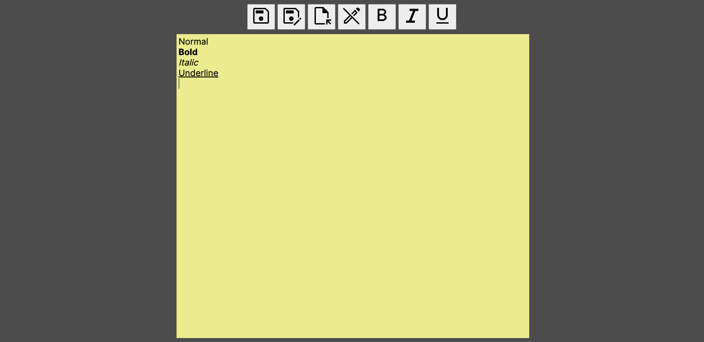

# MinSticky

A single page sticky note with formatting options. Replicates a WYSIWYG style of text formatting.

Written in TypeScript. Icons are from Material Symbols.

WIP.

Do not use this for permanent text saving. This is merely meant for copy and pasting down temporary things like website links and very small notes. No personal or important information should be written as there is a high chance of losing your data.

# Saving and Formatting

There are two save options.

1) The save icon is the standard save text function. This will save your text as a `.txt` file. Be careful if you reload your browser, since you'll lose all changes as there is no persistent storage at the moment.
 
2) The sync icon is the save syncing function. You'll have to click on the sync icon initially to create a `.txt` file (saved in the directory of your choice), and it will automatically save changes to the file when you write in the sticky note text area. Once you close the tab, save syncing will stop. Be careful if you reload your browser since you'll stop syncing changes.

Files are saved as plain text only and any rich text formatting (bold, italic, underline, etc) will not be included.

Aside from the save functions, there are also text formatting options. At the moment there are no active indicators to see which formatting options you're currently using.

1) Bold text formatting. If you want to undo bold formatting, click on the bold icon again to go back to normal text.
2) Italic text formatting. If you want to undo italic formatting, click on the italic icon again to go back to normal text.
3) Underline text formatting. If you want to undo underline formatting, click on the underline icon again to go back to normal text.
